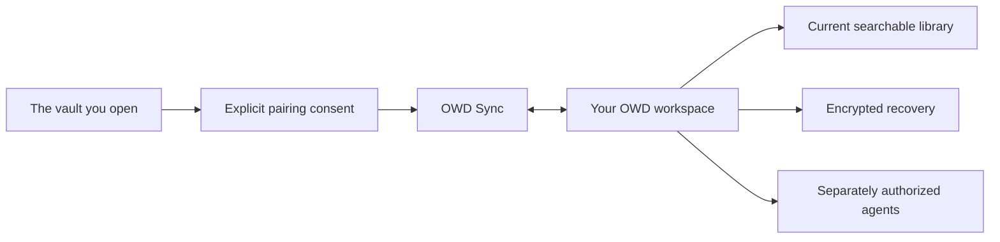

# OWD Sync

[](https://github.com/msinclair25/owd-sync/releases/tag/0.1.6)
[](LICENSE)
[](https://mdevolved.com/#alpha-access)

**Keep your Obsidian vault the source. Connect only the workspace you approve.**

OWD Sync is the deliberately narrow Obsidian companion for
[OWD Platform](https://mdevolved.com). It connects only the vault you
explicitly open and approve to one owner-controlled OWD workspace. Your
canonical Markdown remains ordinary Obsidian files while OWD receives the
durable sync state it needs for searchable context, cited agent work, and
encrypted recovery.

[Request private alpha access](https://mdevolved.com/#alpha-access) ·
[See OWD Platform](https://github.com/msinclair25/owd-platform) ·
[Download OWD Sync 0.1.6](https://github.com/msinclair25/owd-sync/releases/tag/0.1.6)

## The connection boundary



| OWD Sync does                                              | OWD Sync never does                                       |
| ---------------------------------------------------------- | --------------------------------------------------------- |
| Pairs the exact open vault after explicit approval         | Silently chooses another vault                            |
| Synchronizes eligible vault state with its OWD destination | Grants an AI agent access                                 |
| Reports the version and safe runtime profile               | Creates, joins, or approves an OWD Project                |
| Keeps its credential inside that vault's plugin settings   | Reads unrelated plugin credentials                        |
| Supports current-library and recovery workflows            | Turns synchronization into an unreviewed agent write path |

> [!IMPORTANT]
> OWD Sync `0.1.6` is an alpha release. It is not yet listed in Obsidian
> Community Plugins. OWD Platform provides a temporary one-click desktop
> installer for invited testers; BRAT is the fallback. Use synthetic test
> vaults until the Community Plugin publication and personal-vault gates pass.

## Install from OWD

The normal alpha path starts in the authenticated OWD **Vaults** folder:

1. In Obsidian, open **Settings → Community plugins** and choose
   **Turn on community plugins**. OWD cannot bypass this Obsidian security
   consent.
2. Fully quit Obsidian with **Obsidian → Quit Obsidian** or **⌘Q**. Closing the
   macOS window is not enough.
3. In OWD, choose **Choose vault and install OWD Sync 0.1.6**.
4. In current Chrome or Edge, select the exact vault root containing your notes
   and hidden `.obsidian` folder—not `.obsidian` itself—and choose **Allow** if
   Chrome requests local write access.
5. Reopen Obsidian and confirm **OWD Sync** is enabled in that vault.
6. Return to OWD and create the private pairing request.

The temporary installer writes the three version-matched OWD Sync files and
queues the plugin as enabled for the selected vault. It reads only existing OWD
Sync files and `.obsidian/community-plugins.json` so it can restore them if
installation fails.

It does **not** enumerate notes, upload vault data, retain the selected folder,
change general Obsidian settings, or install an updater.

## Safari, Firefox, or blocked folder picker

Use [BRAT](https://github.com/TfTHacker/obsidian42-brat) as the disclosed
fallback:

1. Reopen the exact vault where you want OWD Sync installed.
2. Install and enable BRAT from Obsidian Community Plugins, then wait until
   BRAT appears in the Command Palette.
3. Open the version-pinned
   [OWD Sync BRAT form](obsidian://brat?plugin=msinclair25/owd-sync&version=0.1.6).
   This link opens BRAT's form; it does not finish the installation. Verify the
   repository and version, choose **Add Plugin**, and wait for BRAT to finish.
4. Enable OWD Sync `0.1.6` under **Settings → Community plugins**.

If the prefilled link does nothing, run **BRAT: Plugins: Add a beta plugin for
testing (with or without version)** from the Command Palette, paste
`https://github.com/msinclair25/owd-sync`, select `0.1.6`, and choose **Add
Plugin**.

Use either the direct installer or BRAT, not both. BRAT is a testing bridge,
not the permanent install experience. OWD Sync will move to Obsidian Community
Plugins after its compatibility, security, mobile, update, and clean-install
gates pass.

## Pair one vault

1. Open the exact vault you intend to connect and confirm OWD Sync `0.1.6` is
   enabled.
2. In OWD, choose **I see OWD Sync 0.1.6 — create request**.
3. Choose **Open Obsidian and pair**.
4. In Obsidian, verify the current vault name and OWD workspace.
5. Choose **Pair and start sync**.

OWD refreshes automatically after the one-time exchange. The pairing request
expires after ten minutes, can be used only once, and never chooses a vault
silently.

If the direct handoff is blocked, open **Manual fallback** in OWD, copy the
request, run **OWD Sync: Pair this vault with OWD** from Obsidian's command
palette, and paste it.

## What OWD Sync does

- Syncs the explicitly paired Obsidian vault with its approved OWD workspace
- Preserves the vault's Markdown/Yjs state across paired devices
- Reports a bounded runtime profile so OWD can avoid exposing private or
  infrastructure files
- Provides pairing, reconcile, snapshot, and diagnostics commands
- Keeps pairing credentials inside that vault's plugin settings

## What OWD Sync does not do

- It does not connect AI agents or grant MCP access.
- It does not create, authorize, or approve OWD Projects.
- It does not select a vault based on its name or reuse another vault's grant.
- It does not give an agent Obsidian CLI, shell, or filesystem authority.
- It does not silently write arbitrary `.obsidian` settings.
- It does not replace OWD's encrypted snapshot and restore layer.

Agent connections, Project consent, owner Decisions, and recovery controls live
in OWD Platform. Keeping those responsibilities separate prevents a local sync
plugin from silently expanding an agent's authority.

## Compatibility

| Component        | Required version                     |
| ---------------- | ------------------------------------ |
| OWD Sync         | `0.1.6`                              |
| OWD Platform     | `1.0.0-alpha.3`                      |
| Obsidian desktop | Current alpha-tested desktop release |
| Direct installer | Current Chrome or Edge over HTTPS    |

Do not mix `main.js`, `manifest.json`, or `styles.css` from different releases.
The complete versioned package and SHA-256 checksums are available on the
[OWD Sync 0.1.6 release page](https://github.com/msinclair25/owd-sync/releases/tag/0.1.6).
The ZIP is a maintainer diagnostic artifact, not the normal tester installation
path.

## Troubleshooting

### Obsidian reports `unrecognized URI action`

OWD Sync is not loaded at version `0.1.6` in the vault Obsidian opened. Confirm
the plugin version and enabled state in that exact vault, then reopen the
pairing request. Use OWD's manual fallback if the direct handoff remains
blocked.

### The installer opens a folder picker

That is expected. Select the vault root—the folder containing `.obsidian`.
OWD cannot choose or inspect a local vault until you explicitly grant the
browser access to that folder.

### The wrong vault is open

Cancel the pairing modal without approving it. Open the intended vault and use
the same unexpired request, or create a fresh request in OWD.

## Development

OWD Sync is developed in the OWD Platform monorepo and promoted into this
sanitized distribution repository. This repository contains the reviewable
adapter, pinned upstream source and notices, tests, build configuration, and
release artifacts.

```sh
pnpm install
pnpm check
```

Individual gates are also available:

```sh
pnpm format:check
pnpm lint
pnpm typecheck
pnpm test
pnpm build
```

See [UPSTREAM.md](UPSTREAM.md) for pinned YAOS provenance and
[SECURITY.md](SECURITY.md) for vulnerability reporting and the complete pairing
trust boundary.

## License

The OWD adapter is licensed under the [Apache License 2.0](LICENSE). Vendored
YAOS components retain their 0BSD notice and provenance.
